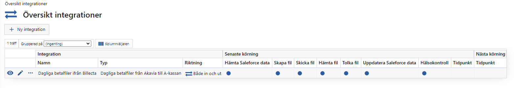
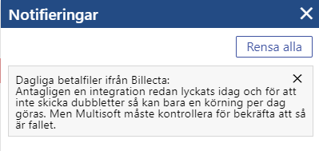

# Demo 2020-11-19

[TOC]

Överblicks vy över alla integrationer.

Tomt nu, men vi kommer lägga till integrationer under demotsgång.

Till vänster har ni vad vi kallar för **Vänster menyn**

Där finns alla menygrupper i systemet. Som ni kan se är det bara två i det här fallet. **Översikt, integrationer** är allt ni ser framför er. **Administration** är lite inställningar som vi kommer komma till senare.

Mitt sektionen är vad vi kallar för en **grid**, vilket är listning av data.

Menyvalsnamn, samt **toppknapp** för att lägga upp en ny integration.

Uppe i högra hörnet har vi följande:

1. En stjärna för att lägga eller ta bort menyvalet ifrån sina Favoriter
2. En knapp för att exportera **gridden** till excel. (alla griddar har en sådan knapp)
3. Klockan är för notifieringar. Den kommer få en siffra vid sig om det finns något att titta på (endast om något fel har uppstått med en integration)
4. Namnet på den inloggade personen
5. En person som går att klicka på för att logga ut

## Ny integration

*Översikt integrationer > Ny integration* är **breadcrums**. Det är för att veta hur man har tagit sig hitt (genom att följa ett spår av brödsmulor).

*Ny integration* är titeln på menyvalet. Det går att klicka på titeln för att gå tillbaka ett steg. Vill man gå tillbaka flera steg så går det också bra att klicka på en breadcrum rubrik.

* Integrationstyp
  * Den typen av integration det här ska vara. Tanken är att det kommer komma en typ för varje integration som vi ska stödja
* Namn
  * Bara för att göra det lite tydligare vilken integration ni syftar på ifall ni lägger upp flera av samma typ
* Pausad
  * Om i checkad så kommer inte integrationen att köras

* Kommunikationsmetod
  * Finns i skrivande stund 2
  * Filsystem - Använd den mycket när jag testat. Då läser och skriver integrationen till en mapp på samma server som systemet
  * SFTP - Skriver och läser integrationen till/från en SFTP-server
* URL
  * Adressen till SFTP-server
* Mapp
  * Om det är någon undermapp som det ska skriva/läsas ifrån
* Användarnamn
  * Det konto som ska användas för att verifiera sig
* Lösenord
  * Det lösenordet som ska användas för att verifiera sig
  * Lämna blankt för att behålla samma lösenord som sist (Ändra integration)
* Port
  * Port som SFTP-server lyssnar på
* Klientcertifikat
  * Kommer vi antagligen inte behöva. Kommer antagligen tas bort
* Ska filer skrivas över
  * Om Nej och det finns en fil så kommer integrationen smälla
  * Om Ja och det finns en fil så skrivs den över

Hur ofta ska den här integrationen köra:

- En dag varje månad
  - Kör det specificerade dagnumret och klockslaget
- Varje dag
  - Kör varje dag vid det angivna klockslaget
- Varje måndag-fredag
  - Kör varje måndag till fredag vid det angivna klockslaget
- Specificera veckodagar
  - Välj själv vilka veckodagar. Samma klockslag alla valda dagar
- Utvalda datum
  - Här kan man ange vilket datum och vilket klockslag som helst
- Endast manuell
  - Integrationen måste startas manuellt

- Hälsokontroll FTP

  - Gör ingen i skrivande stund

- Leveranstillfälle

  - Här kan ni ange förväntat radantal för filer som läses in och för filer som skapas
  - Om radantalet inte är inom det angivna intervallet så kommer integrationen avbrytas och det hela loggas

  

Om Ja, måste ni ange hur många dagar filer ska sparas i databasen innan de automatiskt tas bort.

## Överblick integrationer

Nu har vi en integration och då är det lite lättare att prata om överblicksbilden.

Längst till vänster har ni vad vi kallar för **radknappar**. Ögat är för att gå till en detaljsida. Pennan är för att ändra på integrationen.

*Riktning* är mer tänkt för att visa ifall data går ut eller in i Salesforce. I den här integrationen gör det varken eller. Så går att argumentera att vi borde ha något annat alternativ än "Både in och ut".

*Senaste körning* Visar hur den senaste eller den pågående körningen gick/går.

*Nästa körning* är tom eftersom den här integrationen endast startas manuellt. Annars hade ett datum och klockslag stått där.

## Detaljsidan för en integration

Här har vi två **toppknappar**. En för att ändra på integrationen och en för att starta den manuellt. Ifall en integration behöver kvitteras så tillkommer det en kvitteringsknapp.

Under det kan ni se vad vi kallar för **Infoboxar**. Här presenteras information om integrationen.

Sen har vi **flikar** med ännu mer information.

- Körningshistorik
  - Visar ifall en körning lyckades eller misslyckades
  - Hur lång tid den tog att göra
  - Vem och när den blev kvitterad
- Logg
  - Meddelanden när en integration misslyckas
  - Det kan vara användarvänliga fel som ni kan ta han om själva
  - Kan vara "Multisoft behöver undersöka"
- Kommande körningar
  - Listar datum och klockslag för de 50 nästkommande körningarna
- Filer
  - Listar filer som har läst in i systemet och filer som har skapats av systemet
  - Kolumn för när filen tillkom till databasen
  - Kolumn för när filen lyckades tolka eller när den blev skickad

## Notifiering om att något är fel

Klickar du på klockan får du upp följande:

Nu kan du klicka på notifieringen och kommer då till integrationens detaljsida.

## Administration

Finns inställningar för de olika företagen som systemet integrerar mot. Just nu är vi bara intresserade av Billecta.

### Billecta

* Inloggningsuppgifter till Billecta systemet
  * Användarnamn och lösenord för den användare som ska användas för att hämta information ifrån Billecta
* Dagliga betalfiler
  * Företaget som ska skicka fakturan
  * Produkt
  * Hämtat betalfil till och med
    * För att inte hämta samma uppgifter flera gånger (ni kommer få ändra på det här värdet i testmiljön, men inte i produktion)

För att ta reda på *CreditorPublicId* och *ProductPublicId* så tar vi och loggar in i Billecta systemet.

https://apptest.billecta.com/

Uppe i vänsterhörnet kan man först klicka på företaget och sedan på Alla fakturaavsändare.

Under *fler* finns *CreditorPublicId*

Sedan Register -> Produkter

Längst till höger har vi tre punkter som ger menyn ovan.

## Kvittera

Går att kvittera på två sätt.

Via **toppknappen**

Eller via **radknappen** i körningshistorik fliken.

Oavsett knapp kommer samma kod köras och ni måste alltid bekräfta att ni vill kvittera.

## Lyckad körning

Startade en ny körning

Filen finns även om jag ansluter till SFTP-server med FileZilla.