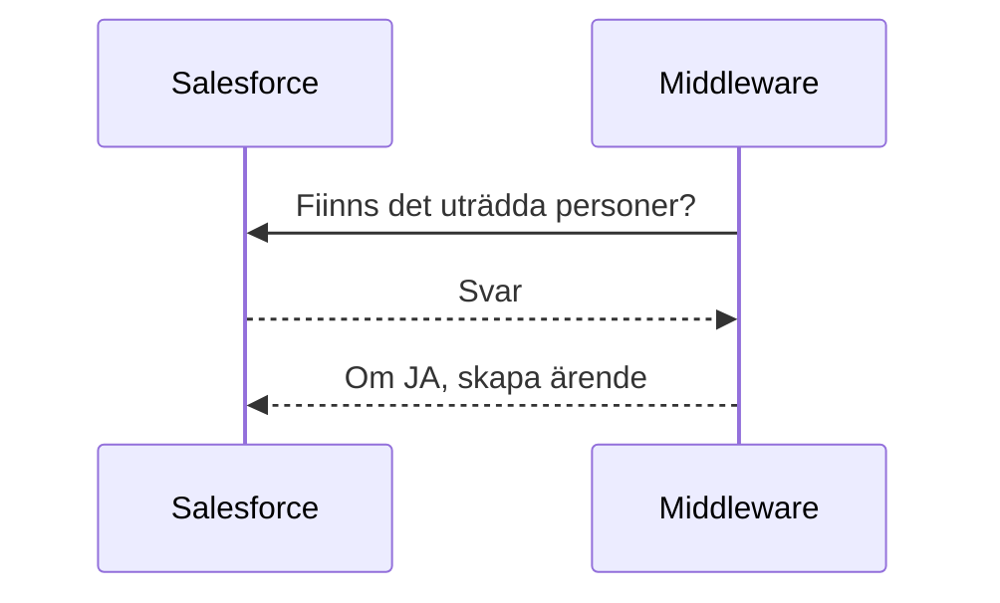
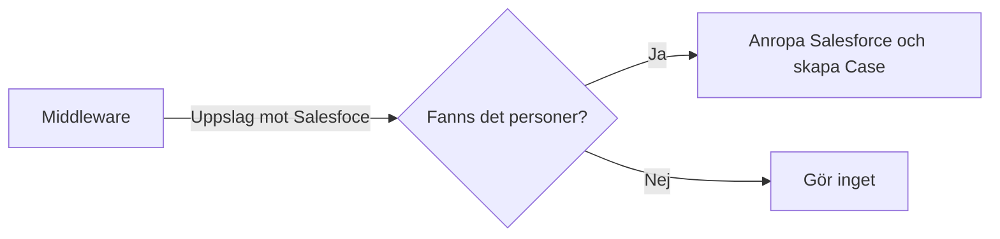

# 08-UT A-Kassa direktanslutning

Efter verkställande av utträde i Salesforce, ska Middleware kontrollera om medlemmen har A-kassa via Akavia och Skapa ett ärende på personen om så är fallet. Medlemsservice går då in på A-kassans webb och direktansluter hen till A-kassan.

Ärendet skapas genom ett anrop mot Salesforce. Salesforce blir då både källa och mottagare av informationen, syftet med detta är inte tekniskt, utan att spara tid i Salesforce-projektet.

## Salesforce

### Filtervillkor

| Krav                                                   | Tabell och fält att kontrollera  i Salesforce              |
| ------------------------------------------------------ | ---------------------------------------------------------- |
| OM                                                     |                                                            |
| Utträdesdatum = månaden innan  denna körning genomförs | Objekt: Account     Fält: CancellationDate__c              |
| OCH                                                    |                                                            |
| Medlemsstatus = Avslutad                               | Objekt: Account     Fält: MembershipStatus__c              |
| OCH                                                    |                                                            |
| A-kassa via Akavia = JA  (checkbox)                    | Objekt: Account     Fält: UnemploymentFundThroughAkavia__c |

**Om allt  ovanstående matchar, ska ett ärende skapas i Salesforce utifrån information i  *utdatafält***

### Utdatafält

Skapa kundcase på personen.

**Objekt**: Case

**Fält**:

- RecordTypeID = Service
- Reason = Medlemsservice
- Type = A-kassa utträde
- Origin = Web
- Description: Kontrollera a-kassamedlemskap på medlem enligt rutin

!> OBS, Fälten ska ha värden ovan

## Middleare

Om integrationen körs flera gånger under samma månad, är det troligt att det kommer skapas dubblett-case i Salesforce, då Middleware inte loggar vilka personer som den skapat Case för.