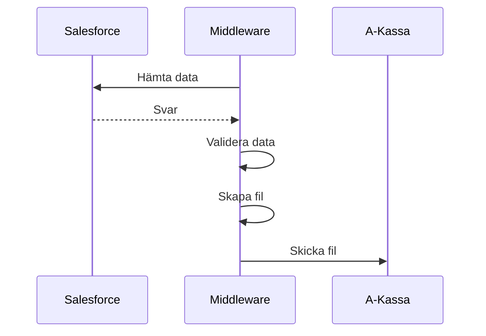

# 10-UT A-Kassa SINK

Tar ut information om aktiva medlemar och nyligen avslutade medlemskap.



## Salesforce

### Filtervillkor

| Krav                                                         | Tabell  | Fält                                                       | Kommentar                                                    |
| ------------------------------------------------------------ | ------- | ---------------------------------------------------------- | ------------------------------------------------------------ |
| Kontakten ska vara aktiv i förbunet                          | Account | MembershipStatus__c<br />LatestMembershipDate\_\_c         | MembershipStatus__c = 'aktiv'<br />LatestMembershipDate\_\_c <= datum för sista dagen i månaden innan |
| Medlemar som fyllt 65 år ska inte med i filen                | Account | Age__c                                                     | Det här fältet saknar ibland värde. Därför görs en första filtrering på fältet, men vi hämtar också SocialSecurityNumber__c för att själva kunna räkna ut åldern. |
| Om medlemskapet avslutats den sista i föregående månad så ska personen med i filen | Account | MembershipStatus__c<br />LatestMembership\_\_r.Endate\_\_c | MembershipStatus__c = 'avslutad'<br />LatestMembership\_\_r.Endate\_\_c = datum för sista dagen i månaden innan |

### Data att hämta/Utdata i filen

| Fält nr | Fältnamn                  | Antal tecken | Format       | Exempel | Salesforce                                           | Kommentar                                                    |
| ------- | ------------------------- | ------------ | ------------ | ------- | ---------------------------------------------------- | ------------------------------------------------------------ |
| 1       | Medlemsmånad              | 6            | ÅÅÅÅMM       | 201412  |                                                      | Middleware tar fram värdet utifrån vilken månad som är den föregående månaden. Om filen tas ut 2020-11-01 så ska värdet vara 202010 |
| 2       | Förbundsnummer            | 2            | 00           | 15      |                                                      | Förbundskod för Akavia. Ändras under Administration -> Systeminställningar |
| 3       | Personnummer              | 12           | ÅÅÅÅMMDD0000 | 12      | Objekt = Account<br/>Fält =  SocialSecurityNumber__c |                                                              |
| 4       | Inträdesmånad i förbundet | 6            | ÅÅÅÅMM       | 200804  | Objekt = Account<br/>Fält =  LatestMembershipDate__c |                                                              |

## Middleware

### Validering

- ~~Giltigt personnummer~~

### Skapa fil

**Filnamnsgenerering:** sinkkontroll_{{forbundskod}}_{{runDate}}.txt

**Teckenkodning:** 1252 (Ansi -Latin I)

**Filtyp:** Alla fält i en följd utan separering (txt)

_exempel:_ sinkkontroll_15_20200229.txt

```text
20200215197308059281199701
20200215195907121486199204
20200215196010223912199504
20200215198001213514200311
20200215198512088520201108
20200215197101293582199610
```

## A-Kassa

### Skicka fil

Får fil skickad till sig utifrån inställningarna på integrationen.