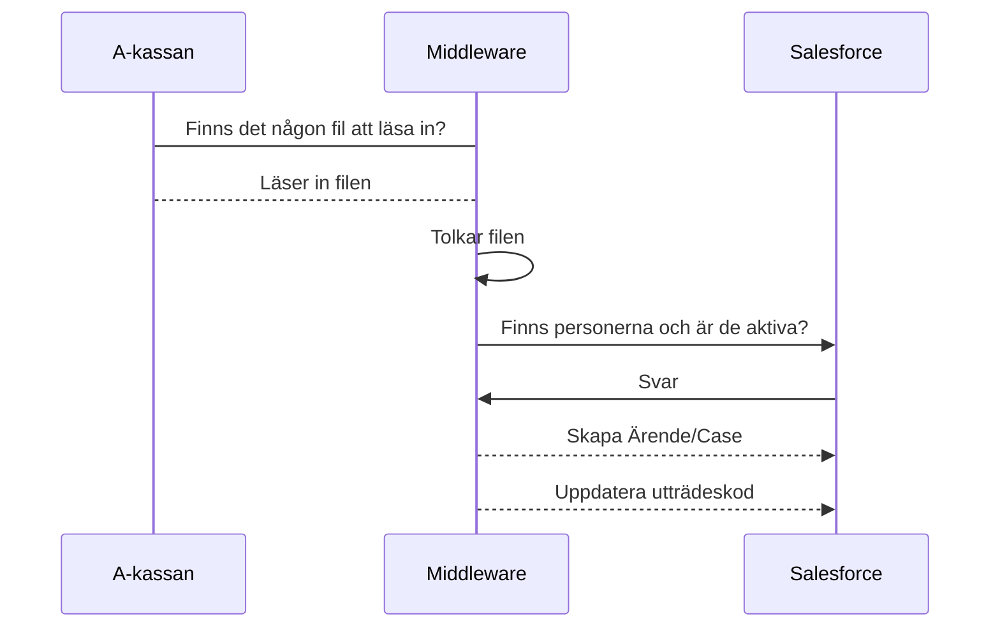

# 12-IN A-kassa återrapport

Filen ska informera respektive förbund om de ändringar Akademikernas a-kassa har gjort på medlemmen gällande inträde, utträde och betalinformation. Förbunden kan hämta sin fil varje dag för att ha uppdaterade medlemsuppgifter. 

Integrationen syftar till två saker:

- Att skapa ärenden/case för att hantera fel manuellt
- I ett fall, uppdatera utträdeskod på personkortet




## Fil import

**Filnamnsgenerering:** aea_frb_export_org_15_ÅÅÅÅMMDD.dat
**Teckenkodning:** ANSI
**Kolumnseparering:** tabb
**Filtyp:** .dat
**Schedulering:** Varje dag, måndag - fredag

| Fält, nr | Fältnamn      | Matchas mot  tabell, fält i Salesforce | Fält och objekt  att matcha i Salesforce                     |
| -------- | ------------- | -------------------------------------- | ------------------------------------------------------------ |
| 1        | Personnummer  | X                                      | Objekt  = Account<br />Fält = SocialSecurityNumber__c        |
| 2        | Förnamn       |                                        |                                                              |
| 3        | Efternamn     |                                        |                                                              |
| 4        | Inträdesdatum |                                        |                                                              |
| 5        | Utträdesdatum | X                                      | Objekt  = Account<br />Fält = ExitDateUnemploymentFundByAkassa__c |
| 6        | Utträdeskod   | X                                      | Objekt  = Account<br />Fält = ExitCodeAkassa__c              |
| 7        | Förbundskod   |                                        |                                                              |
| 8        | Sekretess     |                                        |                                                              |

Första raden i filen är en informationsrad med datum då filen skapades. Sista raden innehåller en kontrollsiffra för antalet rader i filen.

*Exempel:* `aea_frb_export_org_15_20200427.dat`

```text
AEA Förbundsexport kollektiv	20200427
196201286751	Göran	Smedberg	20200401			15	0
196610152404	Susanne	Blomberg	20040901	20200430	6	15	0
197010210321	Kerstin	Andres	20151201	20200430	6	15	0
198705226226	Emma	Klasa	20200401	20200401	5	15	0
198705226226	Emma	Klasa	20200401	20200401	4	15	0
198710036925	Ida	Gustafsson	20200401	20200401	5	15	0
198710036925	Ida	Gustafsson	20200401	20200401	4	15	0
199211213419	Christoffer	Nessvi	20200401			15	0
199411295505	Julia	Garib	20200501			15	0
199412014517	Hampus	Kalderén	20200401			15	0
199603198723	My	Gustafsson	20200401	20200401	6	15	0
199603198723	My	Gustafsson	20200401	20200401	4	15	0
199606057397	Khaldoun	Younis-Khalid	20200401			15	0
Antal poster i filen:	15
```

## Kontroll av data i filen

Varje rad i filen ska kontrolleras mot Salesforce och i 5 scenarion ska det skapas upp ett Case/Ärende för personen.

Kontrollera:
**Objekt:** Account

| Fält                                | Används          | Syfte                      |
| ----------------------------------- | ---------------- | -------------------------- |
| SocialSecurityNumber\__c            | Skapa ärende     | Finns personen             |
| MemberShipStatus_\_c                | Skapa ärende     | Är den aktiv               |
| UnemploymentFundThroughAkavia\_\_c  | Skapa ärende     | Har den A-kassa via Akavia |
| ExitCodeAkassa_\_c                  | Uppdatera person | Utträdeskod                |
| ExitDateUnemploymentFundByAkassa__c | Uppdatera person | Lämnat A-kassan            |

Skapa Case/Ärende:
**Objekt** Case

| Fält         | Värde                                     |
| ------------ | ----------------------------------------- |
| RecordTypeId | Service                                   |
| Reason       | Medlemsservice                            |
| Type         | A-kassa förbundsfil                       |
| Origin       | Web                                       |
| Subject      | Förbundsfil A-kassa                       |
| Description  | Förbundsfil för A-kassa, **Olika värden** |

Förnamn, Efternamn, inträdesdatum,  utträdesdatum, utträdesorsak ska läggas till i fält: Description med rubriker, så att det är läsbart samt att man kan identifiera vad som är vad

### Om personnumret inte finns i Salesforce

Skapa ett ärende till servicekön där **Description** = `Förbundsfil för A-kassa, personnummer saknas`

### Om personnumret finns i Salesforce, men inte är aktiv medlem i förbundet

Skapa ett ärende till servicekön där **Description** = `Förbundsfil för A-kassa, utträdd medlem`

### Om personnumret finns i Salesforce, är aktiv medlem och inte har a-kassa via Akavia

Skapa ett ärende till servicekön där **Description** = `jämför befintligt inträdesdatum med datumet i filen enligt rutin`

### Om personnumret finns i Salesforce, är aktiv medlem, har a-kassa via Akavia, och utträdeskod i filen är blankt

Skapa ett ärende till servicekön där **Description** = `Förbundsfil för A-kassa, jämför befintligt inträdesdatum med datumet i filen enligt rutin`

### Om personnumret finns i Salesforce, är aktiv medlem, har a-kassa via Akavia, och utträdeskod i filen innehåller data

Skapa ett ärende till servicekön där **Description** = `Förbundsfil för A-kassa, hantera direktanslutning enligt rutin`

#### Fyll i utträdeskod på personkortet, fyll i datum för utträde hos a-kassa

Om personen har lämnat A-kassan så ska personkortet uppdateras med utträdeskoden och utträdesdatumet.