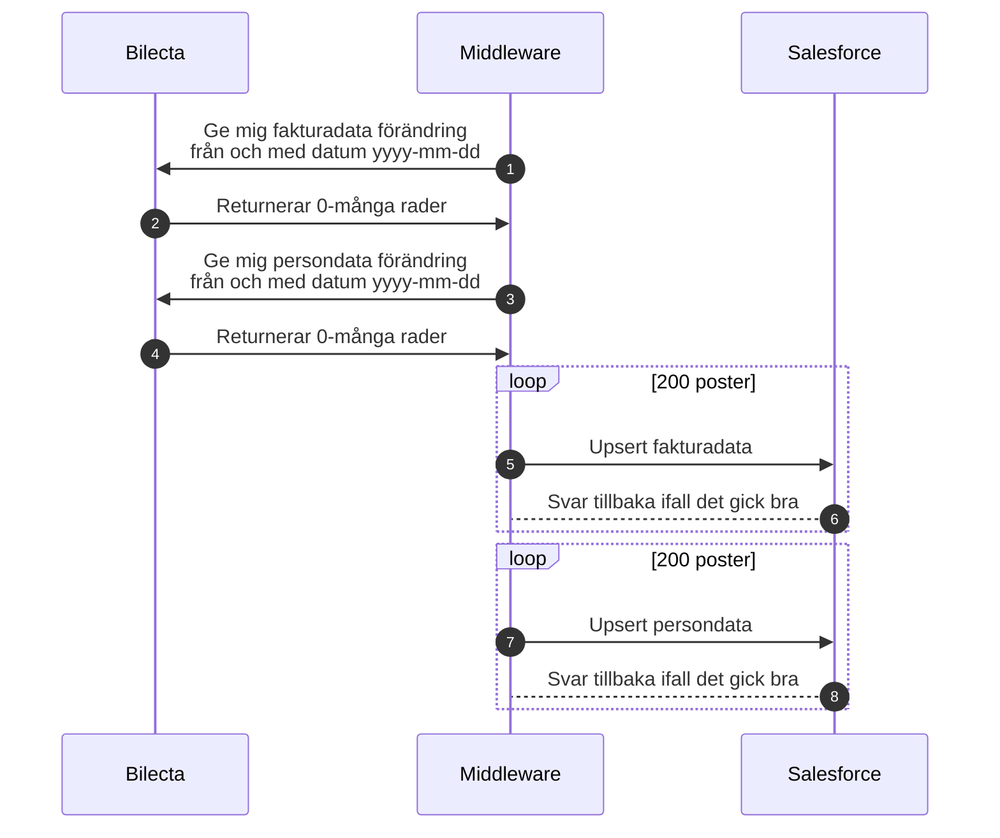

# 32-IN Sökbar information i Salesforce

Syftet är att löpande hålla CRM uppdaterat med hjälp av Middleware, då det finns begränsningar i antalet API-anrop Salesforce kan hantera. Vid skapandet av 100-tusentals fakturor överstiger vi annars dessa begränsningar.

Middleware använder sig av API anropen under sektionen [Sökbar information i Salesforce](Integrationer\Billecta\Integrationer-med-Billecta.md#sökbar-information-i-salesforce) för att hämta data ifrån Billecta. Sedan görs UPSERT anrop till Salesforce för att uppdatera en rad ifall den finns eller skapa den ifall den inte fanns.

## Bra att tänka på

## Vanliga fel

## Dokument

[32-IN Sökbar information i Salesforce Kravunderlag.xlsx](https://multisoftse.sharepoint.com/:x:/s/Delatteam-AkaviaMultisoft/EV1mAENewmVFmE1f9ih3tdkBhh2LkB0ff0sQAgk1Th93lQ?e=PdPcZY ':ignore')