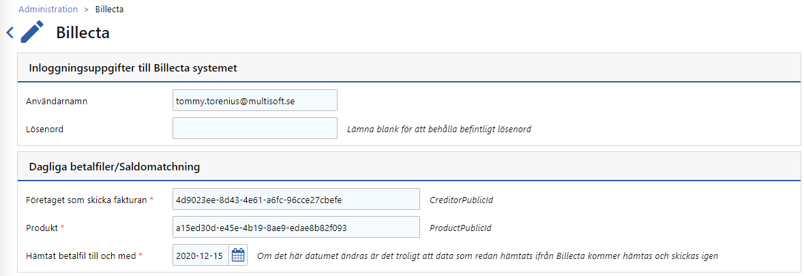
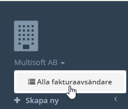
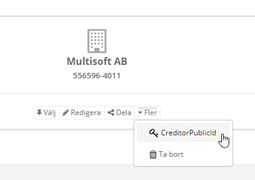
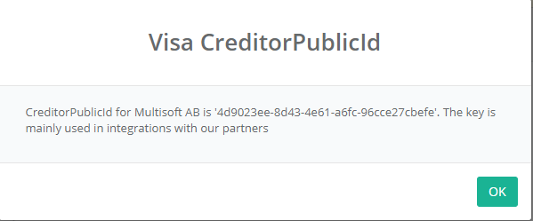
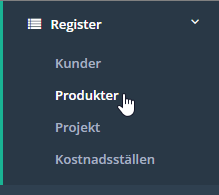
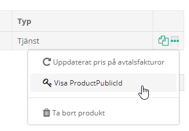
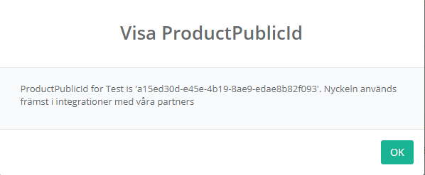

# CreditorPublicId och ProductPublicId

Båda är GUID-värden som Billecta använder för att kunna integrera med andra systemet.
Exempelvis `4d9023ee-8d43-4e61-a6fc-96cce27cbefe`

Middleware använder de värderna vid anrop till Billecta för att filtrera vilken information som ska hämtas.

## CreditorPublicId

GUID-värdet för det företag som skickar fakturor. För att hämta det värdet, logga först in på Billecta.

Uppe i vänsterhörnet kan man först klicka på företaget och sedan på Alla fakturaavsändare.

Under fler finns **CreditorPublicId**

## ProductPublicId

GUID-värde för den produkt som Middleware ska hämta information om. De hittas i vänstermenyn under Register -> Produkter

Längst till höger har vi tre punkter som ger menyn ovan.

