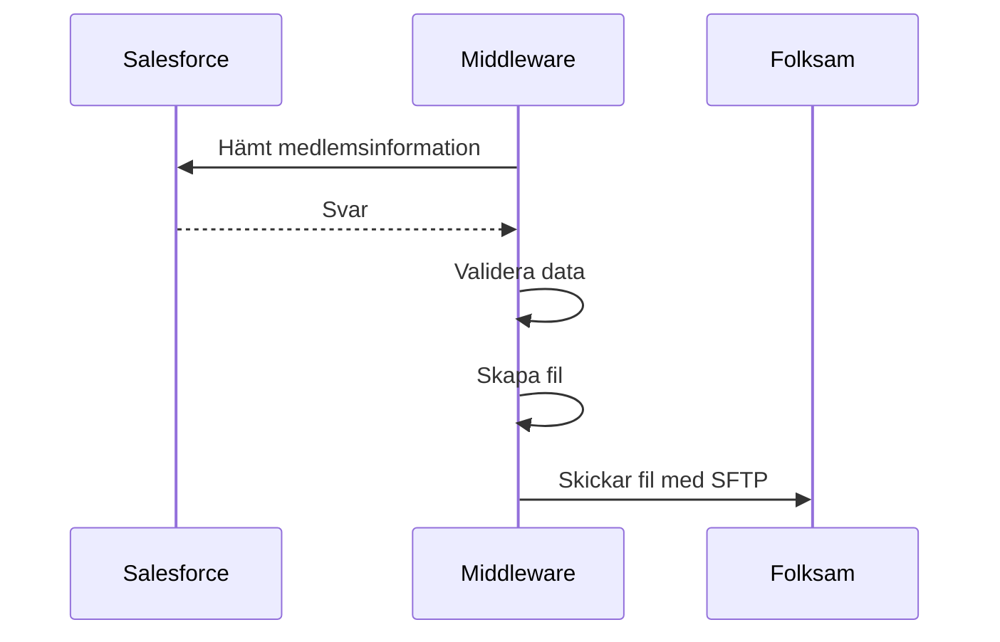

# 02-UT Försäkringsbolag

Skapar och skickar medlemsuppgiftsfil till Folksam. Filen skickas den 8:e varje månad och skickas i sin helhet innehållande alla medlemmar som har tillgång till Folksam-förmånen. Folksam matchar filen gentemot föregående månad och kontrollera att antalet medlemmar stämmer överens. Därefter tar Folksam över kontakten gentemot respektive medlem och erbjuder dem förmånen.

## Bra att tänka på

- Inställningar för medlemsstatus kod finns under Administration -> Saco

## Dokument

[02-UT Försäkringsbolag (Folksam) Kravunderlag.xlsx](https://multisoftse.sharepoint.com/:x:/s/Delatteam-AkaviaMultisoft/Ebpf1K-mK0dEmC8Vi4KYhUkB92rkSdx8oZHYASBdZ4e-EQ?e=v4Jh3z ':ignore')

[BACKEND.O21.COPY.AKAVIA](https://multisoftse.sharepoint.com/:u:/s/Delatteam-AkaviaMultisoft/Eb4JZaG3KKNJowGSYtcbfJQBt9V7qJDh2F8Uo0gn7O6LGQ?e=cXF1ug ':ignore')

[Beskrivning Folksam UT-fil.docx](https://multisoftse.sharepoint.com/:w:/s/Delatteam-AkaviaMultisoft/Ebjo5BPIA-9KmC0n8SSb69IBmi6tc7Ohl7A6BNGSU0JduQ?e=jhlHQM ':ignore')