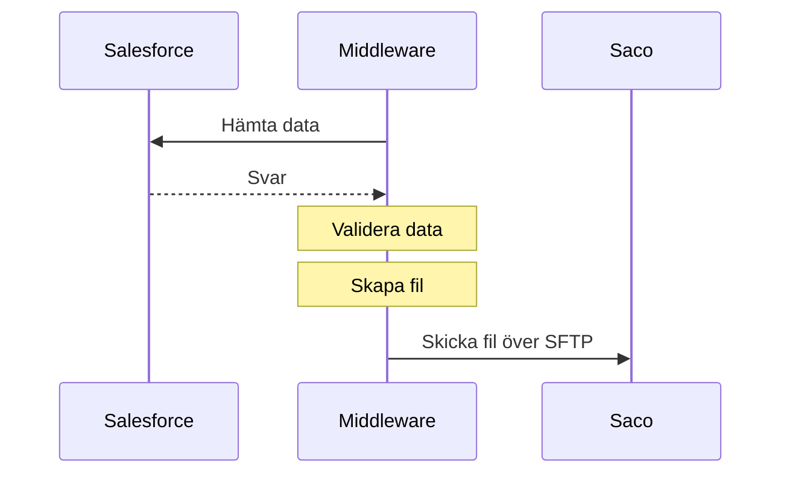

# 03-UT Medlemsstatistik

Medlemsfiler skickas till Saco varje månad.

## Bra att tänka på

- Personer med skyddad identitet kommer inte med i filen

## Dokument

[03-UT Medlemsstatistik (Saco) Kravunderlag.xlsx](https://multisoftse.sharepoint.com/:x:/s/Delatteam-AkaviaMultisoft/Ed0KM_VWBSdMkcU0jFHdy0MBVmaoWGZN067o_NPareL0hg?e=Ouzjuu ':ignore')

[Beskrivning UT Medlemsstatistik.doc](https://multisoftse.sharepoint.com/:w:/s/Delatteam-AkaviaMultisoft/ER_Ma7HnA8RGgW56PVNroFEBPgVKMil6BMyGbi3q2EffYA?e=cyll1L ':ignore')

[Saco_medlem-20201101073053771297.txt](https://multisoftse.sharepoint.com/:t:/s/Delatteam-AkaviaMultisoft/ESWHg2sY5JZGrcpOBoicLf8BONEW7uVRPsLI6j-pD_BCsQ?e=jfJmhq ':ignore')

