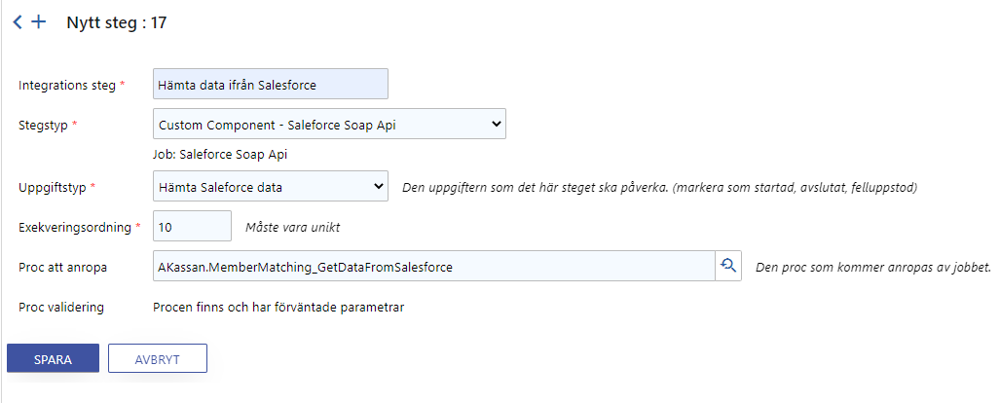
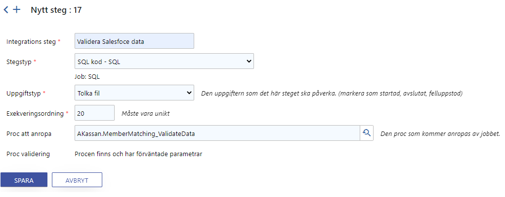
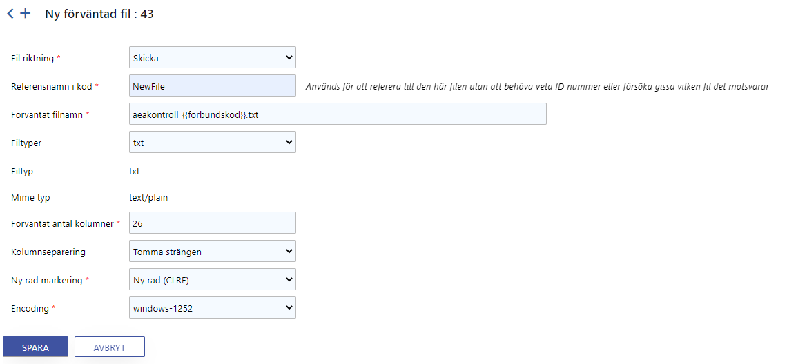
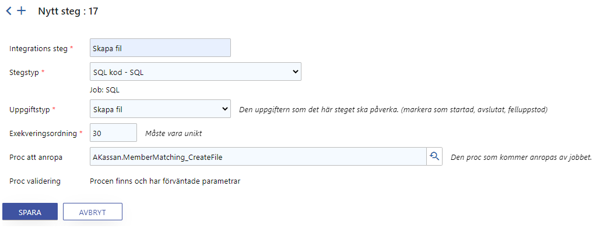
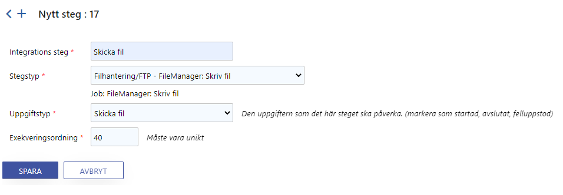

# Hämta data ifrån Salesforce och skapa en fil

I det enklaste scenariot så behövs det 3 steg. Men bara två nya procar. Oftast har det blivit 4 steg och 3 procar.

1. Hämta data ifrån Salesforce
   1. Proc + tabell för att mellanlagra data
2. Validera data
   1. Kontroll av Salesforce data. Det här steget beror på datan som hämtas ifall det behövs
3. Skapa fil
   1. Proc
4. Skicka fil med SFTP
   1. Bara lägga till steget

## Hämta data ifrån Salesforce

 [Workbench](Salesforce\Workbench.md) är din bästa vän för att verifiera att du har en korrekt query.

Ta fram queryn tar allt från 10min för att Akavia har gjort ett bra underarbete till flera timmar för att det inte fungerar som Akavia  har tänkt. Mer komplicerade querys kan också ta lite trail and error tid pga SOQL.

### Vilken data behöver vi hämta?

Först se över vad som ska finnas i filen. De kolumnerna behöver garanterat vara med i SELECT-delen.

| Fältnamn  i nuvarande filer | Antal tecken | Hämtas från  tabell.fält i Salesforce                 | Kommentar                                 |
| --------------------------- | ------------ | ----------------------------------------------------- | ----------------------------------------- |
| Tkod                        | 1            |                                                       | Ska  alltid vara bokstaven "Ä"            |
| Forbundskod                 | 2            |                                                       | Ska  alltid vara förifylld med siffran 15 |
| Personnr                    | 10           | Objekt  = Account<br />Fält = SocialsecurityNumber__c |                                           |
| Efternamn                   | 20           | Objekt  = Account<br />Fält = LastName                |                                           |
| Fornamn                     | 20           | Objekt  = Account<br />Fält = PreferredFirstName__c   |                                           |
| co_adress                   | 25           | Objekt  = Account<br />Fält = CurrentCOAdress__c      |                                           |
| gatuadress                  | 25           | Objekt  = Account<br />Fält = CurrentStreetAdress__c  |                                           |
| postnr                      | 5            | Objekt  = Account<br />Fält = CurrentZipCode__c       |                                           |
| postadress                  | 20           | Objekt  = Account<br />Fält = CurrentCity__c          |                                           |
| landkod                     | 2            | Objekt  = Account<br />Fält = CurrentCountryCode__c   |                                           |

Men sen måste vi även tänka på filter vilkoren:

| Krav                                            | Tabell och fält att kontrollera  i Salesforce    | Kommentar från Akavia |
| ----------------------------------------------- | ------------------------------------------------ | --------------------- |
| Kontakten ska vara aktiv i  förbundet           | Objekt = Account<br />Fält = MembershipStatus__c |                       |
| Medlemmar som fyllt 65 år ska  inte med i filen | Objekt = Account<br />Fält = Age__c              |                       |

Typ exempel på när Akavia har varit optimistiska. Age_\__c är inte ett obligatoriskt fält. Så vi kommer hämta ut DateOfBirth_\__c och SocialSecurityNumber__c för att vara på den säkra sidan.

MembershipStatus__c = 'Aktiv'

### Proc för att hämta data

Procarna för att hämta data ifrån Salesforce har följande namn standard **Schema.Integration_GetDataFromSalesforce**

Där Schema har namnet på företaget/organisationen vi integrerar mot. Integration är försök på engelsköversättning av vad Akavia har kallat integrationen. Det namnet används även i tabellnamn och andra procar.

Slutligen _GetDataFromSalesforce för att visa vad som görs.

```sql
CREATE PROCEDURE AKassan.MemberMatching_GetDataFromSalesforce
	@OccasionId int,
	@OccasionStepId int,
	-- Parametrar som Custom Component sätter
	@Action varchar(100),
	@RequestId int = NULL,
	@IsResult bit = 0,
	@IsLastResult bit = 0,
	@ExtraInformation bit = 0
AS
BEGIN
	SET XACT_ABORT, NOCOUNT ON;
```

@Action = 'Init' är första anropet som görs för att få reda på vad procen vill göra med Salesforce. I det här fallet returnerar vi en Query för att hämta data.

```sql
IF @Action = 'Init'
	BEGIN
	    SELECT
			1 AS [RequestId],
			'Query' AS [Action],
			'SELECT
				SocialSecurityNumber__c,
				LastName,
				PreferredFirstName__c,
				FirstName,
				CurrentCOAdress__c,
				CurrentStreetAdress__c,
				CurrentZipCode__c,
				CurrentCity__c,
				CurrentCountryCode__c,
				LatestMembershipDate__c,
				DateOfBirth__c,
				Age__c
			FROM
				Account
			WHERE
				MembershipStatus__c = ''Aktiv'' AND
				(
					Age__c < 65
					OR
					Age__c = NULL
				)' AS [SoqlQuery]
	END
```

@IsResult = 1 anropas när Custom Component vill skicka ett resultat till procen. Det här anropet kommer ske med upp till 200 poster i #QueryResult (Salesforce returnerar data i batcher om 200 poster).

@IsLastResult = 0 så kommer det komma flera @IsResult = 1 anrop.

@IsLastResult = 1 så är det det sista @IsResult = 1 för det @RequestId värdet

```sql
ELSE IF @IsResult = 1
	BEGIN
	    IF 1 = 0
		BEGIN
			-- Vi får tillbaka en temptabell med varje kolumns namn
		    CREATE TABLE #QueryResult
			(
				SocialSecurityNumber__c nvarchar(MAX) NULL,
				LastName nvarchar(MAX) NULL,
				PreferredFirstName__c nvarchar(MAX) NULL,
				FirstName nvarchar(MAX) NULL,
                CurrentCOAdress__c nvarchar(max) NULL,
				CurrentStreetAdress__c nvarchar(MAX) NULL,
				CurrentZipCode__c nvarchar(MAX) NULL,
				CurrentCity__c nvarchar(MAX) NULL,
				CurrentCountryCode__c nvarchar(MAX) NULL,
				LatestMembershipDate__c nvarchar(MAX) NULL,
				DateOfBirth__c nvarchar(MAX) NULL,
				Age__c nvarchar(MAX) NULL
			);
		END
```

Då Age__c inte alltid har ett värde i Salesforce och vi ska filtrera bort alla personer som är 65 eller högre, så gör vi våran egna uträkning.

```sql
UPDATE
	#QueryResult
SET
	Age__c =SoftadminUtil.Year_AgeFromDates(
			ISNULL(NULLIF(DateOfBirth__c, ''),
            SoftadminUtil.PersonalIdentityNumber_DateOfBirth(SocialSecurityNumber__c)),
			SYSDATETIME())
WHERE
	Age__c = ''; -- Salesforce returnerar tomma strängen istället för NULL

DELETE FROM #QueryResult WHERE Age__c >= 65.0;
```

Slutligen en insert till tabellen Akassan.MemberMatching

```sql
INSERT INTO AKassan.MemberMatching
(
	OccasionId,
	DatetimeInsert,
	SocialSecurityNumber,
	LastName,
	FirstName,
	CoAddress,
	StreetAddress,
	ZipCode,
	City,
	CountryCode,
	CountryName,
	DateLatestMembership
)
SELECT
	@OccasionId,
	SYSDATETIME(),
	QR.SocialSecurityNumber__c,
	QR.LastName,
	ISNULL(NULLIF(QR.PreferredFirstName__c, ''), QR.FirstName),
	QR.CurrentCOAdress__c,
	QR.CurrentStreetAdress__c,
	QR.CurrentZipCode__c,
	QR.CurrentCity__c,
	QR.CurrentCountryCode__c,
	ICC.CountryName,
	QR.LatestMembershipDate__c
FROM
	#QueryResult QR
	LEFT JOIN Util.ISO3166CountryCodes ICC ON
		ICC.Iso2 = QR.CurrentCountryCode__c
```

Lägg upp den som ett steg i integrationen.



## Validera data

I det här fallet finns det fält som är obligatoriska för filen, men inte är obligatoriska i Salesforce. Därför behövs en valideringsproc.

För simple validering behöver vi bara fylla en temptabell (#ErrorCheck) och anropa en valideringsproc. Temptabellen har två obligatoriska kolumner:

- SortOrder
  - Vad som den ska sortera på
  - Kommer inte med i resultatet
- Fel
  - Felmeddelande kolumn

Alla andra kolumner kommer presenteras med deras angivna namn.

AKassan.MemberMatching_ValidateData - Samma namnstandard som tidigare. [Företag].[Integration]_ValidateData

```sql
CREATE PROCEDURE AKassan.MemberMatching_ValidateData
	@OccasionId int,
	@OccasionStepId int
AS
BEGIN
	SET XACT_ABORT, NOCOUNT ON;
	
	SELECT
		MM.MemberMatchingId AS [SortOrder],
		MM.SocialSecurityNumber AS [Personnummer],
		MM.LastName AS [Efternamn],
		MM.FirstName AS [Förnamn],
		MM.CoAddress AS [CO adress],
		MM.StreetAddress AS [Gata],
		MM.ZipCode AS [Postnummer],
		MM.City AS [Postort],
		CASE
			WHEN
				MM.CoAddress IS NULL
				OR
				MM.StreetAddress IS NULL
				OR
				MM.ZipCode IS NULL
				OR
				MM.City IS NULL
			THEN
				'Adressuppgifter'
			ELSE
				NULL
		END AS [Fel]
	INTO
		#ErrorCheck
	FROM
		AKassan.MemberMatching MM
	WHERE
		MM.OccasionId = @OccasionId;

	EXEC IntegrationJob.Validate_AbortAndLogOnError
		@OccasionStepId = @OccasionStepId,
		@FriendlyError = 'Obligatorisk data saknas:';
END
```

Lägg till som ett steg i integrationen.



## Skapa fil

Första steget är att lägga upp en inställning för att det ska finnas en fil.

Nästa steg blir att fylla en temptabell med den data som ska finnas i filen. I det här fallet är det en fil där varje kolumn har ett bestämt antal tecken. Därför är alla datatyper **char**, för då säkerställer vi att det blir massa mellanslag automatiskt för att fylla ut.

```sql
CREATE PROCEDURE AKassan.MemberMatching_CreateFile
	@OccasionId int,
	@OccasionStepId int
AS
BEGIN
	SET XACT_ABORT, NOCOUNT ON;
	
	------------------
	-- Ta fram data --
	------------------

	CREATE TABLE #Data
	(
		[$RowNumber] int NOT NULL,
		Tcode char(1) NOT NULL,
		UnionCode char(2) NOT NULL,
		SocialSecurityNumber char(10) NOT NULL,
		LastName char(20) NOT NULL,
		FirstName char(20) NOT NULL,
		CoAddress char(25) NOT NULL,
		StreetAddress char(25) NOT NULL,
		ZipCode char(5) NOT NULL,
		City char(20) NOT NULL,
		CountryCode char(2) NOT NULL,
		CountryName char(20) NOT NULL,
		AltCoAddress char(25) NOT NULL,
		AltStreetAddress char(25) NOT NULL,
		AltZipCode char(5) NOT NULL,
		AltCity char(20) NOT NULL,
		AltCountryCode char(2) NOT NULL,
		AltCountryName char(20) NOT NULL,
		SACO_tidnkod char(1) NOT NULL,
		Akademixkod char(1) NOT NULL,
		WorkplaceCodeFirst char(10) NOT NULL,
		WorkplaceCodeSecond char(10) NOT NULL,
		AEAcode char(1) NOT NULL,
		DateJoined char(6) NOT NULL,
		Ursprintrade char(6) NOT NULL,
		Uttradeskod char(2) NOT NULL,
		Uttrade char(6) NOT NULL
	);
```

AKassan.MemberMatching_CreateFile - [Företag].[Integration]_CreateFile

Temptabellen kan ha valfrit namn, men för att hjälpprocen ``IntegrationJob.Csv_CreateAndInsert`` ska fungera måste det finnas en kolumn som heter [$RowNumber], som koden sorterar raderna efter.

```sql
	DECLARE
		@UnionCode int = SoftadminApi.Setting_Value('AkaviaUnionCode');

	INSERT INTO #Data
	(
		[$RowNumber],
		Tcode,
		UnionCode,
		SocialSecurityNumber,
		LastName,
		FirstName,
		CoAddress,
		StreetAddress,
		ZipCode,
		City,
		CountryCode,
		CountryName,
		AltCoAddress,
		AltStreetAddress,
		AltZipCode,
		AltCity,
		AltCountryCode,
		AltCountryName,
		SACO_tidnkod,
		Akademixkod,
		WorkplaceCodeFirst,
		WorkplaceCodeSecond,
		AEAcode,
		DateJoined,
		Ursprintrade,
		Uttradeskod,
		Uttrade
	)
	SELECT
		MM.MemberMatchingId,
		'Ä',
		@UnionCode,
		RIGHT(MM.SocialSecurityNumber, 10), -- 12 siffriga nummren ifrån Salesforce
		RIGHT(MM.LastName, 20),
		RIGHT(MM.FirstName, 20),
		RIGHT(MM.CoAddress, 25),
		RIGHT(MM.StreetAddress, 25),
		RIGHT(MM.ZipCode, 5),
		RIGHT(MM.City, 20),
		ISNULL(MM.CountryCode, ''),
		ISNULL(MM.CountryName, ''),
		'',-- Fält som inte används av Akavia
		'',
		'',
		'',
		'',
		'',
		'0',
		'',
		'',
		'',
		'',
		CONVERT(varchar(6), MM.DateLatestMembership, 112), -- YYYYMM
		'000000',
		'00',
		'000000'
	FROM
		AKassan.MemberMatching MM
	WHERE
		MM.OccasionId = @OccasionId;
```

Ta fram info om filen som förväntas att skapas utifrån dess referenskod. Sätt filnamn och skapa filen utifrån inställningarna.

```sql
	-------------------------
	-- Skapa och spara fil --
	-------------------------

	DECLARE
		@Filename varchar(255),
		@IntegrationTypeExpectedFileId int = IntegrationJob.Outgoing_GetIntegrationTypeExpectedFileId_ToCreate(@OccasionStepId, 'NewFile');

	SELECT
		@Filename = REPLACE(ITEF.ExpectedFilenamePattern, '{{förbundskod}}', @UnionCode)
	FROM
		Integration.IntegrationTypeExpectedFile ITEF
	WHERE
		ITEF.IntegrationTypeExpectedFileId = @IntegrationTypeExpectedFileId;

	EXEC IntegrationJob.Csv_CreateAndInsert
		@OccasionStepId = @OccasionStepId,
		@IntegrationTypeExpectedFileId = @IntegrationTypeExpectedFileId,
		@SourceTable = '#Data',
		@Filename = @Filename;
```

Lägg upp procen som ett nytt steg.

## Skicka fil

Bara lägga upp steget, då Akavia själva kan ställa in inställningar för skickningen.

