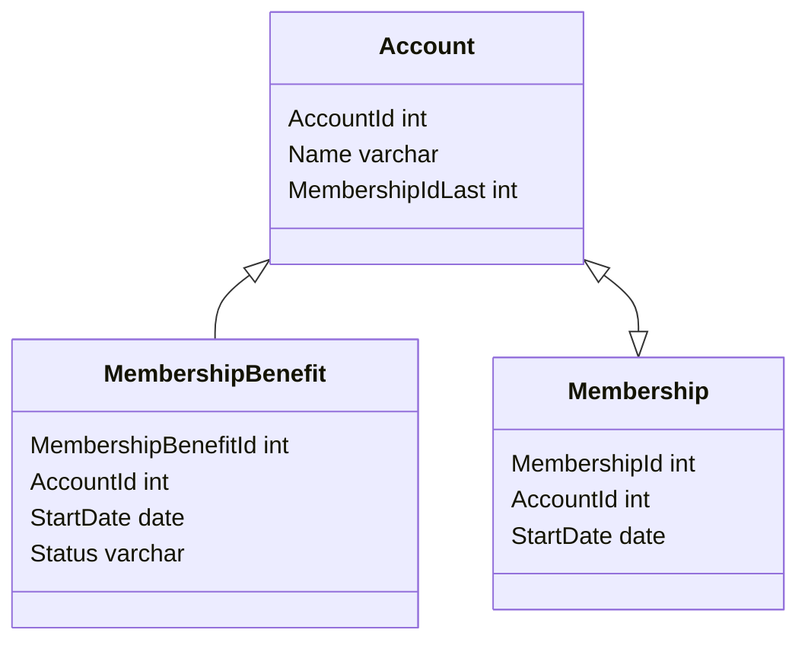

# SOQL och dess begränsningar

Tycker att det är lättare ifall man tänker att det är klasser i C# än sql tabeller.

```c#
public class Account
{
    public string Name {get; set;}
    
    public List<MembershipBenefit> MembershipBenefits {get; set;}
    
    public Membership LastMembership {get; set;}
}

public class MembershipBenefit
{
    public DateTime StartDate {get; set;}
    
    public string Status {get; set;}
    
    public Account Person {get; set;}
}

public class Membership{
    
    public Account Account {get; set;}
    
    public DateTime StartDate {get; set;}
    
    public List<Account> Accounts {get; set;}
}
```



## Vad betyder __c

Fält och tabeller som inte ingår i stock Salesforce får postfixen **__c** för att Salesfoce ska garantera att fälten och tabellerna funkar även i framtiden i fall det kommer något fält eller tabell med samma namn i en nyare version.

Exempel: MembershipBenefit är en unik tabell för Akavia och måste därför skrivas som MembershipBenefit__c

## Vad betyder __r

Ifall man vill använda en custom-kolumn för att "joina" med så måste man byta ut **__c** mot **__r**

Exempel:

Account har en kolumn som heter **LatestMembership__c** som innehåller Id värdet till det senaste Membership. Men vill man titta på något fält i från Membership tabellen så måste man skriva **LatestMembership__r**.StartDate__c

## "join"

Det går inte att joina på ett sätt som vi är vana vid. 

https://developer.salesforce.com/docs/atlas.en-us.soql_sosl.meta/soql_sosl/sforce_api_calls_soql_relationships.htm

### Förälder

Om man vill komma åt fält för en förälder så kommer man åt det genom att sätta en punkt efter FK namnet och sedan skriva namnet på kolumnen. Det går att gå max 5 steg upp.

SOQL:

```mssql
SELECT
	Account.LatestMembership__r.StartDate__c
FROM
	Account
```

SQL:

```mssql
SELECT
	M.StartDate
FROM
	Account A
	JOIN Membership M ON
		M.MembershipId = A.LatestMembershioId
```

### Barn

För att komma åt fält ifrån barn måste man göra en subquery. Går bara att komma åt barn ett steg ifrån föräldern.

SOQL:

```mssql
SELECT
name,
(
	SELECT
		StartDate__c
    FROM
		MembershipBenefits__r
)
FROM
	Account
```

Tabellen heter MembershipBenefit.

Men för att det är en child-tabell vi försöker komma åt så måste dess pluralform användas därav MembershipBenefit**s**

SQL:

```mssql
SELECT
	A.Name,
	MB.StartDate
FROM
	Account A
	JOIN MembershipBenefit MB ON
		MB.AccountId = A.AccountId
```

Barn varianten stöds inte i nuvarande CustomComponent. Anledningen är att svaret man får tillbaka är ett "id-värde" för att kunna göra ett nytt anrop till SalesForce. Inte en tillplattad lista som vi är vana vid i SQL.

Vilket gör att det först blir ett anrop till Salesforce för att få ut alla Accounts. Sen blir det ett nytt anrop för varje rad som returnerades. Eftersom vi är oroliga att vi kommer gå över taket på antalet anrop vi får göra till Salesforce, så ska vi undvika Barn joins så länge vi kan.

## WHERE

https://developer.salesforce.com/docs/atlas.en-us.soql_sosl.meta/soql_sosl/sforce_api_calls_soql_select_comparisonoperators.htm

#### IS NULL / IS NOT NULL

Kolumn = null
Kolumn != null

#### IN

Det verkar som de vill att man ska filtrera genom att child tabeller selectar ut förälderns Id i en subquery.

```mssql
SELECT
	name
FROM
	Account
WHERE
	Id IN
	(
        SELECT
        	Person__c
       	FROM
        	Membership__c
       	WHERE
        	Status__c = 'Aktiv'
    )
```

