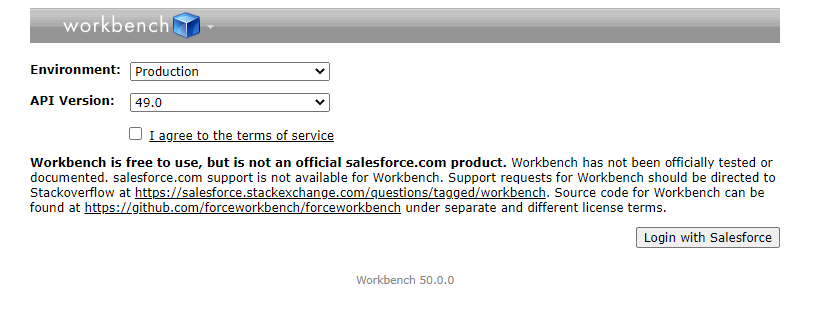
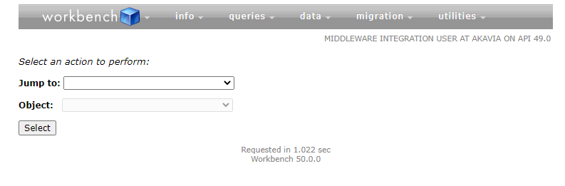
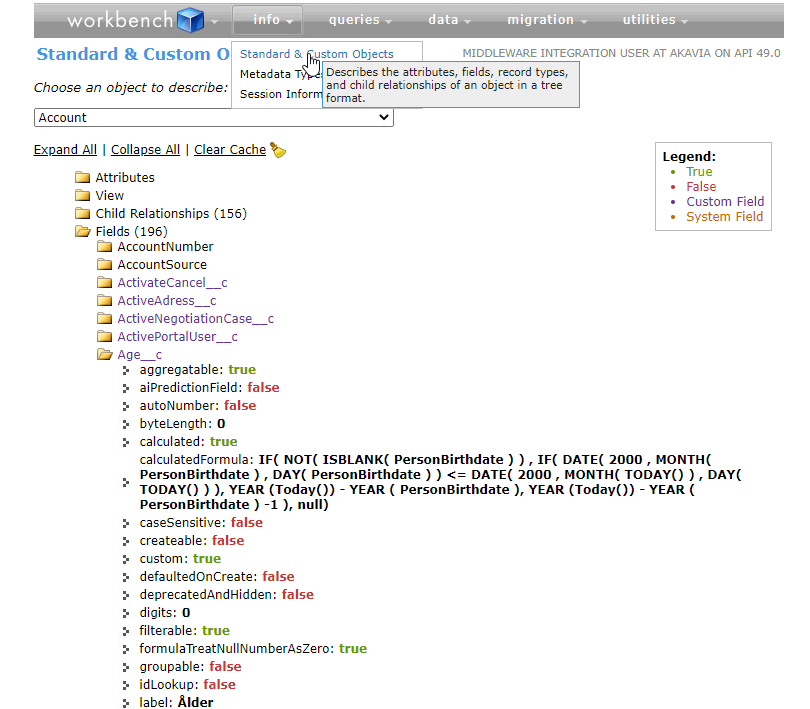
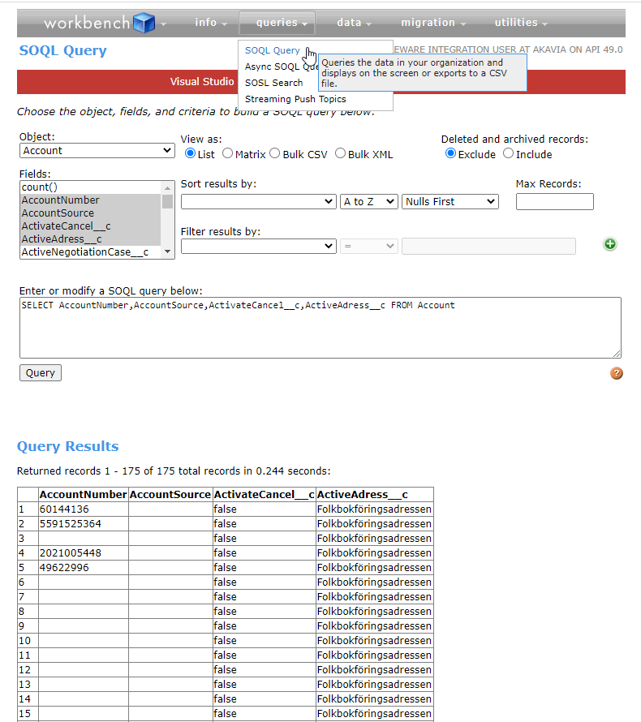

# Workbench

Din bästa vän när du vill kontrollera något i Salesforce.

https://workbench.developerforce.com/login.php

Börja med att välja infall du ska logga in i Prod eller Sandbox (stage)

## Info: Standard & Custom Objects

Här kan du få fram information om alla object (tabeller) som finns i Salesfoce.

I bilden ovan kan du exempelvis se att Age__c är ett beräknat fält.

Alla fält som slutar på **__c** är customfält som har lagts till för Akavia vill ha dem. Alla andra fält är Salesforce standard fält.

## Queries: SOQL Query

Användbar av två anledningar:

1. Välj ett object och de kolumner du vill bara för att se vilken data som finns i en tabell
2. Du kan skriva din helt egna SOQL query och testa ifall koden kan parsas och se vilket resultat du får

