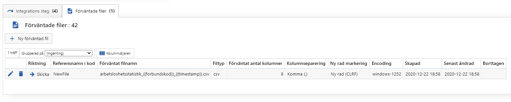

# Förväntade filer

> Administration > Integrationstyper > Visa integrationstyp (Bara Multisoft)



Ange inställningar för filer som ska hämtas och parsars eller filer som ska skapas och skickas.

- Riktning
  - Hämta/Skicka
- Referensnamn i kod
  - För att inte hårdkoda Id-värden så hämtar kod info utifrån det här namnet
- Förväntat filnamn
  - Det namnet som vi letar efter när vi hämtar en fil
  - Det namnet som filen får när vi skapar filen
- Filtyp
  - Avgör hur filen behandlas
- Förväntat antal kolumner
  - Värde som används när vi parsar CSV filer
  - Även när vi skapar CSV filer
  - Kontroll görs på filen att vi skapat/parsat förväntat antal kolumner
- Kolumnseparering
  - Ska CSV filen separers med komma, semikolon eller kanske tab?
- Ny rad markering
  - Bara CLRF i skrivande stund
- Encodning
  - Vilken Encoding är filen vi läser in
  - Vilken Encoding ska vi skapa filen i

## Hämta fil

Akavia anger själva på integrationen varifrån filen ska hämtas. Vanliga scenariot kommer vara någon SFTP server. Om *Förväntat filnamn* kommer kunna exaktmatchas för att filen alltid heter samma sak, behöver ingen proc anges för hämta fil. Annars måste en proc anges.

Den procen kommer få två temptabeller:

```sql
-- Alla filer som finns i mappen Akavia anget
CREATE TABLE #List 
(
	DatetimeCreated datetime NULL, -- NULL för FTP och FTPS
	DatetimeModified datetime NULL, -- NULL för FTP och FTPS
	IsDirectory bit NOT NULL,
	IsHidden bit NULL, -- NULL = fick ingen info
	IsReadOnly bit NULL, -- NULL = fick ingen info
	Name varchar(255) NOT NULL,
	ParentDirectory varchar(MAX) NOT NULL,
	SizeInBytes bigint NULL -- NULL om Directory
);

-- Procen förväntas att fylla på information i den här tabellen över den eller de filer som ska hämtas
CREATE TABLE #FilesToRead
(
	ParentDirectory varchar(MAX) NOT NULL,
	Name varchar(255) NOT NULL,
	IntegrationTypeExpectedFileId int NULL
);
```

### Parsa fil

Efter att filen har hämtats så behöver den antagligen parsas.

1. Ange en temptabell med
   1. RowNumber
   2. De kolumner som förväntas finnas
2. Hämta Id-värdet för filen som läst in
3. Parsa filen
4. Gör något med Temptabellen

```sql
CREATE TABLE #FileContent
(
	RowNumber int NOT NULL,
	SocialSecurityNumber varchar(50) NULL,
	PersonName varchar(50) NULL,
	DateSignedUpAF varchar(50) NULL
);

DECLARE
	@IntermediateFileId int;

SELECT
	@IntermediateFileId = IntegrationJob.Incoming_GetIntermediateFileId_ToParse(OS.OccasionStepId, '<Förväntat filnamn>')
FROM
	IntegrationJob.OccasionStep OS
WHERE
	OS.OccasionStepId = @OccasionStepId;

EXEC HealthControl.Csv_ParseAndCheck
	@IntermediateFileId = @IntermediateFileId,
	@TempTableName = '#FileContent'
```

### HealthControl.Csv_ParseAndCheck

Hjälpt proc som parsar filer med Filtyp = CSV utifrån inställnignarna i *Förväntade filer*. Procen kontrollerar även antalet kolumner och ifall Akavia har ställt in på integrationen så kontrolleras även antalet rader.

## Skicka fil

1. Fyll en temptabell med data
2. Hämta ut Id-värdet på den *förväntade filen*
3. Om filnamnet har något värde som ska ersättas gör det
4. Skapa filen

```sql
CREATE TABLE #Data
(
	[$RowNumber] int NOT NULL,
	UnionCode char(2) NOT NULL,
	SocialSecurityNumber char(12) NOT NULL,
	ZipCode char(5) NOT NULL,
	PersonSection varchar(50) NULL,
	TradeAssociation varchar(50) NULL,
	ManagerTradeAssociation varchar(3) NOT NULL,
	PersonBransch varchar(100) NULL,
	CountyCode varchar(50) NULL
);

DECLARE
	@UnionCode int = SoftadminApi.Setting_Value('AkaviaUnionCode');

INSERT INTO #Data
(
	[$RowNumber],
	UnionCode,
	SocialSecurityNumber,
	ZipCode,
	PersonSection,
	TradeAssociation,
	ManagerTradeAssociation,
	PersonBransch,
	CountyCode
)
SELECT
	US.UnemploymentStatisticsId,
	@UnionCode,
	US.SocialSecurityNumber,
	REPLACE(US.CurrentZipCode, ' ', ''),
	US.PersonSection,
	US.TradeAssociation,
	IIF(US.ManagerTradeAssociation = 1, 'Ja', 'Nej'),
	US.PersonBransch,
	US.CountyCode
FROM
	AKassan.UnemploymentStatistics US
WHERE
	US.OccasionId = @OccasionId;

-------------------------
-- Skapa och spara fil --
-------------------------

DECLARE
	@Filename varchar(255),
	@IntegrationTypeExpectedFileId int = IntegrationJob.Outgoing_GetIntegrationTypeExpectedFileId_ToCreate(@OccasionStepId, 'NewFile');

SELECT
	@Filename = REPLACE(REPLACE(ITEF.ExpectedFilenamePattern, 
		'{{forbundskod}}', @UnionCode),
		'{{timestamp}}', FORMAT(SYSDATETIME(), 'yyyyMMddHHmmssffffff'))
FROM
	Integration.IntegrationTypeExpectedFile ITEF
WHERE
	ITEF.IntegrationTypeExpectedFileId = @IntegrationTypeExpectedFileId;

EXEC IntegrationJob.Csv_CreateAndInsert
	@OccasionStepId = @OccasionStepId,
	@IntegrationTypeExpectedFileId = @IntegrationTypeExpectedFileId,
	@SourceTable = '#Data',
	@Filename = @Filename;
```

### IntegrationJob.Csv_CreateAndInsert

Skapar en CSV-fil utifrån de inställningar som finns på den *förväntade filen*, så som kolumnseparere, encoding.

Validerar också antalet kolumner och rader.