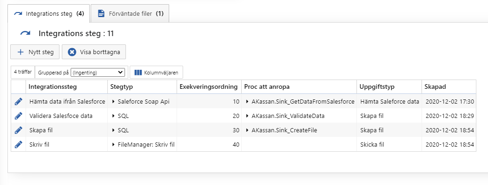

# Integrationssteg

> Administration > Integrationstyper > Visa integrationstyp (Bara Multisoft)

Varje integration består av en eller flera steg. När en integration körs så utförs alla stegen uppifrån och ner (Exekveringsordning). Ifall ett steg misslyckas så avbryts hela integrationen. Om alla stegen blir slutförda så räknas integrationskörningen som lyckad.

- Integrationssteg

  - Bara ett användarvänligt namn för Multisoftare

- Stegtyp

  - Det SoftadminJobb som utför steget

- Exekveringsordning

  - Vilken ordning som stegen utförs i

- Proc att anropa

  - Många [Stegtyper](Softadmin\Stegtyp.md) kräver att man specificerar en proc med vad som ska utföras

- Uppgiftstyp

  - De steg som Akavia ser status på

- Skapad

  - Bara info

  

