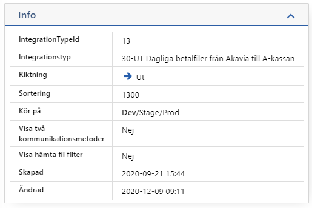
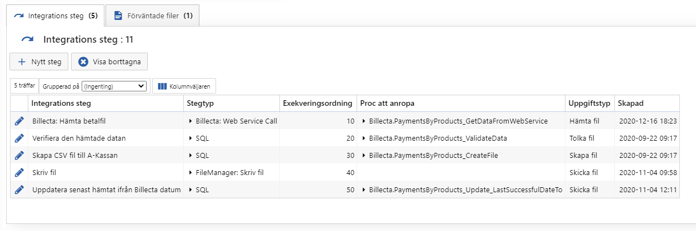
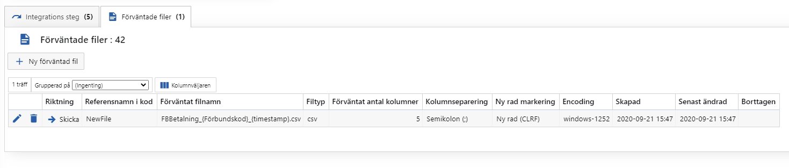

# Integrationstyper

När Akavia lägger upp Integrationer så får de välja vilken integrationstyp som integrationen ska avse. Integrationstypen blir därför grupperingen av all underliggande logik.

Integrationstyperna hittas under

> Administration -> Integrationstyper -> Visa integrationstyp

## Generella inställningar

- Integrationstyp
  - Vilket användarvänligt namn ska visas för Akavia
- Riktning
  - Bara visuellt för att göra det tydligare om data hämtas eller uppdateras i Salesforce
- Sortering
  - Vilken ordning de ska sorteras i vid presentation
- Kör på
  - Inspirerat ifrån plattformsjobben
  - Möjliggör att vi kan ta testintegrationer i Dev
  - Även att vi kan säga att en integration som är under testning inte ska finnas i prod
    - Vilket gör att vi kan deploya säkert
- Visa två kommunikationsmetoder
  - Avgör om 1 eller 2 **Kommunikationsmetod** går att konfigurera på Integrationen
- Visa hämta fil filter
  - Avgör ifall Akavia själva ska kunna ange filter-villkor för vilka filer som ska hämtas

## Integrationssteg

Alla typer består av ett eller flera [integrationssteg](Softadmin\Integrationssteg.md) 

Här anges vilka [stegtyper](Softadmin\Stegtyp.md) och procar som ska köras för att utföra integrationen.

## Förväntade filer

Många men inte alla integrationer skickar eller läser filer. Regler för filnamn mm ställs in under [förväntade filer](Förväntade-filer.md) 

