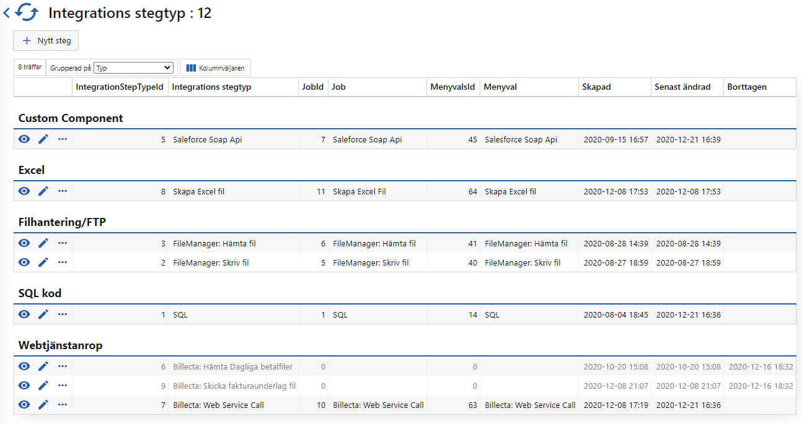

# Stegtyp

> Multisfot > Integrations stegtyp



Varje steg är ett eget Softadmin job. I regel kör de varje minut och kontrollerar mot vyn `IntegrationJob.OccasionStep_CanExecute` ifall det finns något för jobbet att utföra.

Syftet med att ha stegtyper som enskilda jobb istället för att varje Integration som Akavia kan lägga upp, är att minska ner antalet ställen som felhanteringslogik måste finnas. Om varje integration var ett eget jobb skulle det bli väldigt mycket kodduplicering för felhanteringen och stor risk att någon kod inte skulle uppdateras ifall något fel med felhanteringen upptäcktes.

## SQL stegtypen

Det här är den enklaste stegtypen, så tar den som exempel. (Alla andra steg är uppbyggda på samma sätt)

1. Kontrollera om det finns något steg att utföra
2. BEGIN TRY
   1. Startar steget med `IntegrationJob.OccasionStep_Start`
   2. Anropas procen som angetts på [integrationssteget](Softadmin\Integrationssteg.md) 
   3. Om allt har gått bra avsluta steget med `IntegrationJob.OccasionStep_Completed`
3. END TRY
4. Om exception kastades logga att det blev fel och avbryt integrationen med `IntegrationJob.OccasionStep_Error`

**Sudo kod**

```sql
DECLARE
	@OccasionStepId int,
	@ProcedureName varchar(300);
	
SELECT
	@OccasionStepId = OSCE.ccasionStepId
	@ProcedureName = OSCE.ProcedureName
FROM
	IntegrationJob.OccasionStep_CanExecute OSCE
	
BEGIN TRY
	EXEC IntegrationJob.OccasionStep_Start
		@OccasionStepId = @OccasionStepId;
		
	EXEC @ProcedureName
		@OccasionStepId = @OccasionStepId;
	
	IF OK
	BEGIN
		EXEC IntegrationJob.OccasionStep_Completed
			@OccasionStepId = @OccasionStepId;
	END
END TRY
BEGIN CATCH
	IF @@TRANCOUNT > 0 ROLLBACK TRANSACTION;

	EXEC IntegrationJob.OccasionStep_Error
		@OccasionStepId = @OccasionStepId,
		@ProcId = @@PROCID;

	RETURN -1;
END CATCH
```

Stegtypen blir nu en wrapper som har hand om statusarna som Akavia ser, men även felhantering så att integrationen inte hamnar i något half-state.

Det här gör att SQL kod procarna blir väldigt simpla, vilket ger en bra överblick och lätta att hotfixa/uppdatera.

Många SQL kod används för

- Parsa filer
- [Valideringsprocar](Softadmin\Valideringsprocar.md)
- Skapa filer