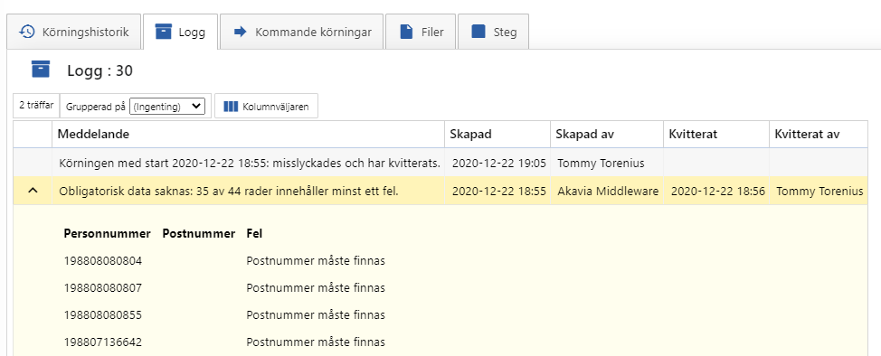

# Valideringsprocar

Har försökt att namnge de enligt standarded \<Företag vi integrerar mot>.\<Integrationensnamn på engelska>_ValidateData

_Exempel:_ AKassan.UnemploymentStatistics_ValidateData

```sql
ALTER PROCEDURE AKassan.UnemploymentStatistics_ValidateData
	@OccasionId int,
	@OccasionStepId int
AS
BEGIN
	SET XACT_ABORT, NOCOUNT ON;

	SELECT
		US.UnemploymentStatisticsId AS [SortOrder],
		US.SocialSecurityNumber AS [Personnummer],
		US.CurrentZipCode AS [Postnummer],
		CASE
			WHEN
				SoftadminUtil.PersonalIdentityNumber_IsValid(US.SocialSecurityNumber) = 0
			THEN
				'Ogiltigt personnummer'
			WHEN
				US.CurrentZipCode IS NULL
			THEN
				'Postnummer måste finnas'
			ELSE
				NULL
		END AS [Fel]
	INTO
		#ErrorCheck
	FROM
		AKassan.UnemploymentStatistics US
	WHERE
		US.OccasionId = @OccasionId;
	
	EXEC IntegrationJob.Validate_AbortAndLogOnError
		@OccasionStepId = @OccasionStepId,
		@FriendlyError = 'Obligatorisk data saknas:';
END
```

Den här procen kontrollerar data som finns i tabellen `AKassan.UnemploymentStatistics` för att säkerställa att alla fält som måste ha ett värde ha det värdet.

Den använder sig av hjälp-procen `IntegrationJob.Validate_AbortAndLogOnError` som kräver att en temptabell med namnet `#ErrorCheck` finns. 

```sql
CREATE TABLE #ErrorCheck
(
	SortOrder int NOT NULL,
	Fel varchar(MAX) NULL
);
```

Minimum krav är att SortOrder och Fel finns. Alla andra kolumner kommer komma med i felloggen med deras kolumn namn.

**@FriendlyError** Meddelande + antalet rader med fel = Huvudfelmeddelandet

**#ErrorCheck** Blir en html tabell och visas som ett extra fel.



